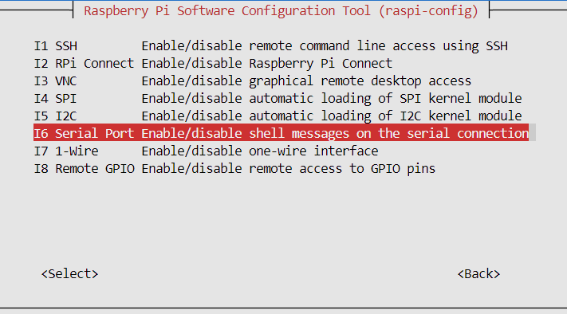
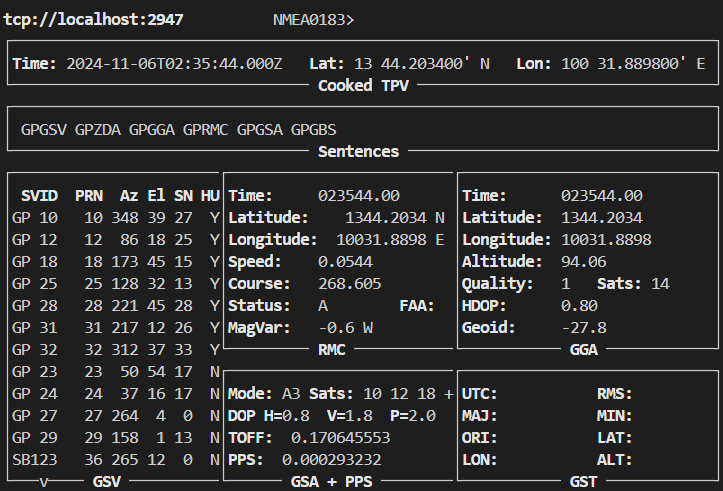
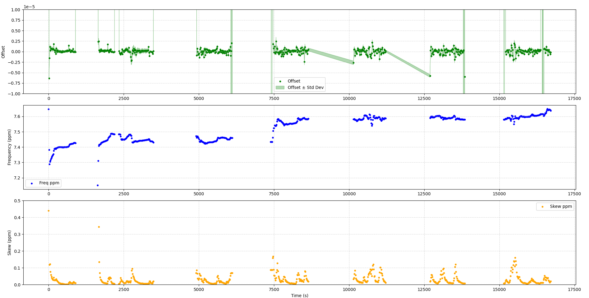
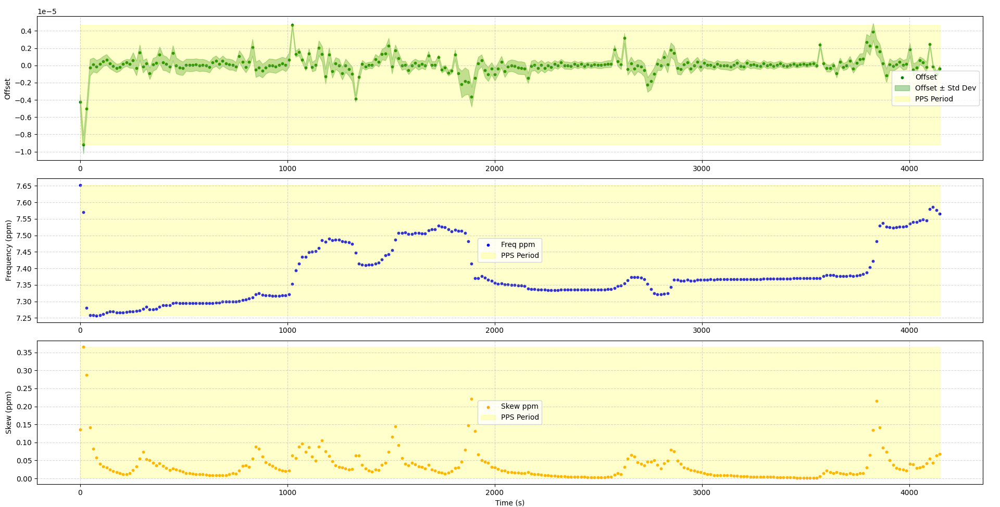
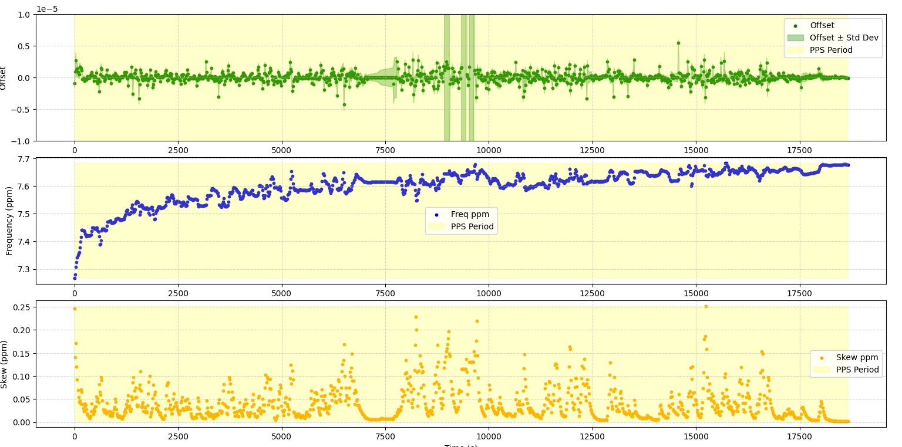
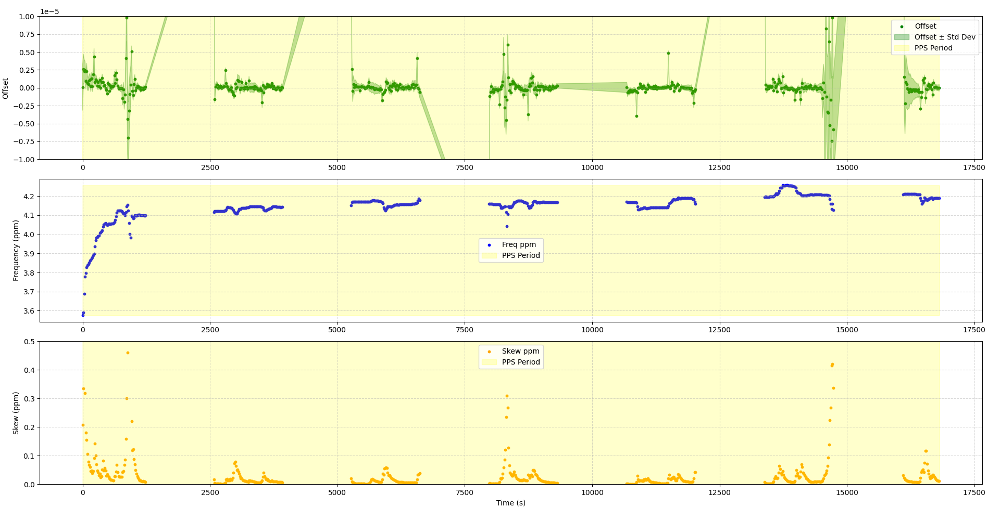

# Building an Accurate NTP Server on Raspberry Pi 4 Using GNSS and PPS
The Network Time Protocol (NTP) server is used to synchronize the system's time accurately. To achieve this precision, a GNSS module with PPS (Pulse Per Second) support is used. GNSS provides highly accurate time due to the atomic clocks on satellites, allowing the receiver to act as a Stratum 1 NTP server. Results show that when the PPS signal is tracked, the offset between the system time and GNSS time is within microsecond accuracy. However, as NTP transmits time over the network, client-side delays remain in the sub-millisecond range. The following tutorial details how to set up an NTP server on a Raspberry Pi 4 using a GNSS module. 

## Hardware Requirements
- Raspberry Pi 4 Model b
- SparkFun GNSS Receiver Breakout - MAX-M10S (Qwiic)
- MAX3232 RS232 to TTL
- FT232RL USB To Serial Adapter Module
- CH347 Development Board Module High Speed USB to UART / I2C / SPI / JTAG / GPIO
- MCU FT232H High Speed Multifunction USB to JTAG UART/FIFO SPI/I2C Module  

## Method 1: Using PPS directly from Pi GPIO
### Set up raspberry pi and install required packages
```bash
sudo apt update
sudo apt upgrade
sudo apt install pps-tools gpsd gpsd-clients python3-gps chrony
```
edit `/boot/firmware/config.txt`

```bash
sudo bash -c "echo 'dtoverlay=pps-gpio,gpiopin=18' >> boot/firmware/config.txt"
sudo bash -c "echo 'enable_uart=1' >> /boot/firmwareconfig.txt"
sudo bash -c "echo 'init_uart_baud=9600' >> /bootfirmware/config.txt"
```

edit `/etc/modules`

```bash
sudo bash -c "echo 'pps-gpio' >> /etc/modules"
```

enable **serial port**  

```bash
sudo raspi-config
```
raspi-config > Interface Options > Serial Port > **Disable** Login Shell over Serial > **Enable** Serial Port Hardware > Reboot





**Connect Pin from GNSS Module to Pi**
| RPi4    | GNSS Module |
| -------- | ------- |
| 3.3V  | 3.3V    |
| GND | GND     |
| GPIO 14 (TX)    | RX    |
| GPIO 15 (RX)    | TX    |
| GPIO 18 | PPS    |

**Verify the PPS configuration**
```bash
lsmod | grep pps
```
Output:
```bash
pps_gpio               12288  0
```
**PPS signal verification**
```bash
sudo ppstest /dev/pps0
```
Output:
``` bash
trying PPS source "/dev/pps0"
found PPS source "/dev/pps0"
ok, found 1 source(s), now start fetching data...
source 0 - assert 1730781175.001866873, sequence: 817 - clear  0.000000000, sequence: 0
source 0 - assert 1730781176.001865742, sequence: 818 - clear  0.000000000, sequence: 0
source 0 - assert 1730781177.001866742, sequence: 819 - clear  0.000000000, sequence: 0
source 0 - assert 1730781178.001867926, sequence: 820 - clear  0.000000000, sequence: 0
source 0 - assert 1730781179.001866573, sequence: 821 - clear  0.000000000, sequence: 0
source 0 - assert 1730781180.001869202, sequence: 822 - clear  0.000000000, sequence: 0
```

### GPSD Configuration
edit `/etc/default/gpsd`
```bash
sudo nano /etc/default/gpsd
```
The `/dev/ttyS0` is used for serial communication of NMEA information while `/dev/pps0` is used for PPS
```bash
# Devices gpsd should collect to at boot time.
# They need to be read/writeable, either by user gpsd or the group dialout.
START_DAEMON="true"
DEVICES="/dev/ttyS0 /dev/pps0"

# Other options you want to pass to gpsd
GPSD_OPTIONS="-n"

# Automatically hot add/remove USB GPS devices via gpsdctl
USBAUTO="true"
```
```bash
sudo reboot
```
**Verify that gpsd receive information from GNSS module**
```bash
gpsmon -n
```
The output should show timing information as well as the PPS


### Set up Chrony NTP server
```bash
sudo nano /etc/chrony/chrony.conf
```

Add or uncomment the following configuration in order to enable hardware reference clock and allow local devices (i.e. 192.168.x.x) to sysnchronize to chrony NTP server
```bash
# Hardware Timesources
refclock SHM 0 refid NMEA noselect
refclock PPS /dev/pps0 lock NMEA refid PPS prefer

# Allow local devices to synchronize time
allow 192.168.0.0/16

# Uncomment the following line to turn logging on.
log tracking measurements statistics
```
```bash
sudo systemctl restart chrony
```

**Verify that Chrony is working properly**
The clocks from GNSS module are shown as NMEA and PPS.
```bash
chronyc -n sourcestats -v
```
```bash
                             .- Number of sample points in measurement set.
                            /    .- Number of residual runs with same sign.
                           |    /    .- Length of measurement set (time).
                           |   |    /      .- Est. clock freq error (ppm).
                           |   |   |      /           .- Est. error in freq.
                           |   |   |     |           /         .- Est. offset.
                           |   |   |     |          |          |   On the -.
                           |   |   |     |          |          |   samples. \
                           |   |   |     |          |          |             |
Name/IP Address            NP  NR  Span  Frequency  Freq Skew  Offset  Std Dev
==============================================================================
NMEA                       29  17   448    +16.466     16.880    -46ms  3089us
PPS                        18  11   272     -0.001      0.008     -1ns   620ns
202.12.97.45                7   4   453     +2.902     16.979  -1420us  1026us
202.29.58.130              11   9   458     +0.306      0.569  -3718us    74us
147.50.17.138               8   5   264     -0.677      5.360  -1738us   277us
203.159.70.33               8   6   265     +7.136     27.789   +213us  1112us
```
```bash
chronyc sources -v   
```
```bash
  .-- Source mode  '^' = server, '=' = peer, '#' = local clock.
 / .- Source state '*' = current best, '+' = combined, '-' = not combined,
| /             'x' = may be in error, '~' = too variable, '?' = unusable.
||                                                 .- xxxx [ yyyy ] +/- zzzz
||      Reachability register (octal) -.           |  xxxx = adjusted offset,
||      Log2(Polling interval) --.      |          |  yyyy = measured offset,
||                                \     |          |  zzzz = estimated error.
||                                 |    |           \
MS Name/IP address         Stratum Poll Reach LastRx Last sample
===============================================================================
#? NMEA                          0   4   377    16    -45ms[  -45ms] +/- 1577us
#* PPS                           0   4   377    16   -625ns[ -798ns] +/-  166ns
^- ntp.kku.ac.th                 1   6   367    43  -2648us[-2649us] +/-   10ms
^- 202.29.58.130                 2   6   377    43  -3716us[-3716us] +/-   43ms
^- 147.50.17.138                 2   6   377    41  -1546us[-1547us] +/- 4386us
^- ntp1.bknix.co.th              1   6   377    41  -1628us[-1628us] +/- 4277us
```
```bash
chronyc tracking
```
```bash
chronyc tracking -v
Reference ID    : 50505300 (PPS)
Stratum         : 1
Ref time (UTC)  : Wed Nov 06 03:08:10 2024
System time     : 0.000000273 seconds slow of NTP time
Last offset     : -0.000000309 seconds
RMS offset      : 0.000186070 seconds
Frequency       : 7.206 ppm fast
Residual freq   : -0.000 ppm
Skew            : 0.006 ppm
Root delay      : 0.000000001 seconds
Root dispersion : 0.000012480 seconds
Update interval : 16.0 seconds
Leap status     : Normal
```
In case that Chrony couldn't track the PPS signal, it's likely because the offset of the NMEA is too large and the PPS couldn't lock the NMEA time. Therefore, the offset can be compensated manually in the `/etc/chrony/chrony.conf` by adding `offset` (in second) to the NMEA. For example,

```bash
refclock SHM 0 refid NMEA offset 0.7 noselect
```

### Experimental Result


|Measurement|Value|
|--|--|
|Average Offset (mean)    |1803.386 us|
|Average Offset (median)  |0.099 us|
|Average Frequency Error  |7.52 ppm|
|Average Frequency Skew   |0.03 ppm|

## Method 2: Using PPS from FT232RL
FT232RL Module converts the data from Serial to USB. Hence, the PPS signal is connected to Data Carrier Detect (DCD) pin instead.

**Connect Pin from GNSS Module to Pi**
| FT232RL    | GNSS Module |
| -------- | ------- |
| 3.3V  | 3.3V    |
| GND | GND     |
| TX    | RX    |
| RX    | TX    |
| DCD | PPS    |

### GPSD Configuration
```bash
sudo nano /etc/default/gpsd
```
```bash
# Devices gpsd should collect to at boot time.
# They need to be read/writeable, either by user gpsd or the group dialout.
START_DAEMON="true"
DEVICES="/dev/ttyUSB0"

# Other options you want to pass to gpsd
GPSD_OPTIONS="-n"

# Automatically hot add/remove USB GPS devices via gpsdctl
USBAUTO="true"
```
```bash
sudo reboot
```

### Set up Chrony NTP server
```bash
sudo nano /etc/chrony/chrony.conf
```
```bash
# Hardware Timesources
refclock SHM 0 refid NMEA noselect
refclock SHM 1 lock NMEA refid PPS prefer

# Allow local devices to synchronize time
allow 192.168.0.0/16

# Uncomment the following line to turn logging on.
log tracking measurements statistics
```

### Experimental Result


|Measurement|Value|
|--|--|
|Average Offset (mean)    |0.047 us|
|Average Offset (median)  |0.032 us|
|Average Frequency Error  |7.38 ppm|
|Average Frequency Skew   |0.04 ppm|

## Method 3: Using PPS from FT232H
Similar to FT232RL, FT232H Module converts the data from Serial to USB. This module can be programmed to modify the operation mode via **FT_PROG** (https://ftdichip.com/utilities/). FT_PROG is used to receive user-setting inputs and program them to the EEPROM. In this tutorial, RS232 UART is configured to the FT232H module. 

**Connect Pin from GNSS Module to Pi**
| FT232H    | GNSS Module |
| -------- | ------- |
| 3.3V  | 3.3V    |
| GND | GND     |
| AD0 (TX)    | RX    |
| AD1 (RX)    | TX    |
| AD6 (DCD) | PPS    |

**The GPSD and Chrony configurations are the same as for the FT232RL.**
### Experimental Result

|Measurement|Value|
|--|--|
|Average Offset (mean)    |0.031 us|
|Average Offset (median)  |0.009 us|
|Average Frequency Error  |7.60 ppm|
|Average Frequency Skew   |0.04 ppm|


## Method 4: Using PPS from CH347
**Note: There's a problem that the gpsd couldn't detect the PPS signal from DCD (Data Carrier Detect)**
```bash
sudo nano /etc/default/gpsd
```
```bash
# Devices gpsd should collect to at boot time.
# They need to be read/writeable, either by user gpsd or the group dialout.
START_DAEMON="true"
DEVICES="/dev/ttyACM0"

# Other options you want to pass to gpsd
GPSD_OPTIONS="-n"

# Automatically hot add/remove USB GPS devices via gpsdctl
USBAUTO="true"
```
```bash
sudo reboot
```

## Method 5: Using PPS from DCD of MAX3232
MAX3232 converts TTL to RS232 which has DCD pin that is used to receive PPS signal. Since the raspberry pi doesn't have DB9 port, the ubuntu 22.04 machine is used instead.


**Connect Pin from GNSS Module to Pi**
Note that the MAX3232 doesn't provide 3.3V to the GNSS module so external 3.3V source is neccessary for GNSS module.
| MAX3232    | GNSS Module | External Voltage Source|
| -------- | ------- | --|
| 3.3V  | 3.3V    | 3.3V|
| GND | GND     | GND |
| TX    | RX    |
| RX    | TX    |
| DCD | PPS    |

**The GPSD and Chrony configurations are similar to the FT232RL. Just need to change the device to `/dev/ttyS0`**

### Experimental Result


|Measurement|Value|
|--|--|
|Average Offset (mean)    |0.427 us|
|Average Offset (median)  |0.005 us|
|Average Frequency Error  |4.15 ppm|
|Average Frequency Skew   |0.04 ppm|

# References
https://austinsnerdythings.com/2021/04/19/microsecond-accurate-ntp-with-a-raspberry-pi-and-pps-gps/
https://www.workswiththeweb.com/piprojects/2023/08/06/RBPi-NTP-Server/